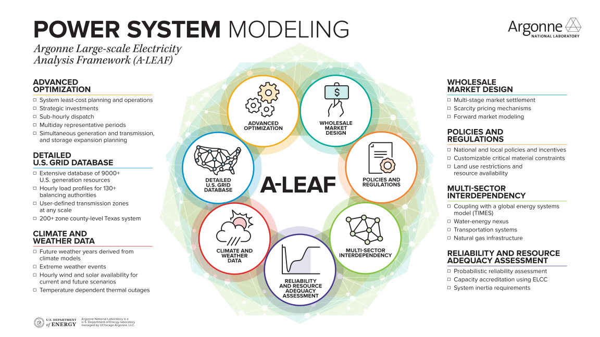
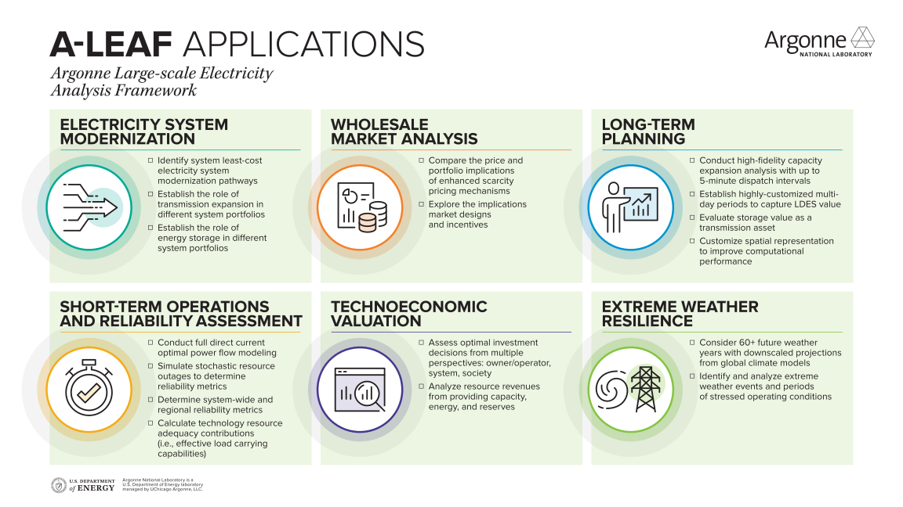

  
  

# Argonne Large-Scale Electricity Analysis Framework (A-LEAF)

An integrated national-scale simulation framework for power system operations and planning.

## What A-LEAF is
A-LEAF is an integrated, national-scale power system simulation framework that includes capacity expansion, unit commitment, and economic dispatch models. It determines least-cost generation investment and retirement plans, transmission investment plans, and hourly system schedules under user-defined assumptions for technology characteristics, electricity demand, system requirements, and market design.

The three model families (expansion planning, operation, and reliability assessment) can be used as standalone tools or as linked stages of one study workflow.

The same models run at **multiple network resolutions**, from the bundled sub-state grouping (`Country subdivision`) up through `BA zone`, `BA`, `Interconnection`, and `Country` aggregations. Aggregated levels use database-driven aggregation and snapshot-based network (PTDF) reduction. User-supplied finer-resolution databases are also supported. See [Network Resolution](./database/Network_Resolution.md).

This site documents the inputs, settings, models, and outputs needed to set up a study, run it, and interpret the results.

!!! tip "New here?"
    - **Running A-LEAF for the first time?** Start with [Getting Started](./Getting_Started.md): installation, running a first case, and where to find the output.
    - **Unfamiliar acronym?** The [Glossary](./Glossary.md) defines ELCC, DLOL, PRM, RPS, ATB, ESGC, and the other recurring terms and notation used on this site.

## Capabilities
A-LEAF brings seven capability areas together around one optimization core.

  

- **Advanced optimization.** System least-cost planning and operations, strategic investments, sub-hourly dispatch, multiday representative periods, and simultaneous generation, transmission, and storage expansion planning. See [Model Documentation](#model-documentation).
- **Detailed U.S. grid database.** Generation resources, hourly load profiles for balancing authorities, user-defined transmission zones at any scale, and a county-level Texas system. See [Network Resolution](./database/Network_Resolution.md).
- **Climate and weather data.** Future weather years derived from climate models, extreme weather events, hourly wind and solar availability for current and future scenarios, and temperature-dependent thermal outages.
- **Wholesale market design.** Multi-stage market settlement, scarcity pricing mechanisms, and forward market modeling.
- **Policies and regulations.** National and local policies and incentives, customizable critical-material constraints, and land-use restrictions and resource availability. See [Policy and Financial Settings](./configuration/Policy_and_Financial_Settings.md).
- **Multi-sector interdependency.** Coupling with a global energy systems model (TIMES), the water-energy nexus, transportation systems, and natural gas infrastructure.
- **Reliability and resource adequacy assessment.** Probabilistic reliability assessment, capacity accreditation using ELCC, and system inertia requirements. See [RA Overview](./models/RA/RA_Overview.md).

!!! note "What the public release includes"
    The figures show the full A-LEAF framework. Some items, such as the county-level Texas system, coupling with TIMES, and weather years derived from climate models, use data or models that are not part of this public release. The bundled example is the North America database in `data/NorthAmerica/`.

## Applications
A-LEAF supports studies from long-term planning to short-term operations and reliability.

  

- **Electricity system modernization.** Identify least-cost modernization pathways for the electricity system, and establish the role of transmission expansion and of energy storage in different system portfolios.
- **Wholesale market analysis.** Compare the price and portfolio implications of enhanced scarcity pricing mechanisms, and explore the implications of market designs and incentives.
- **Long-term planning.** Conduct high-fidelity capacity expansion analysis with dispatch intervals as short as 5 minutes, establish highly customized multiday periods to capture the value of long-duration energy storage (LDES), evaluate storage value as a transmission asset, and customize the spatial representation to improve computational performance. See [GTEP Overview](./models/GTEP/GTEP_Overview.md).
- **Short-term operations and reliability assessment.** Run full direct-current optimal power flow, simulate stochastic resource outages to determine reliability metrics, determine system-wide and regional reliability metrics, and calculate the resource adequacy contribution of each technology (its effective load carrying capability, ELCC). See [Operation Overview](./models/Operation/Operation_Overview.md) and [RA Metrics](./models/RA/RA_Metrics_ELCC_and_DLOL.md).
- **Technoeconomic valuation.** Assess optimal investment decisions from several perspectives (owner/operator, system, and society), and analyze resource revenues from providing capacity, energy, and reserves.
- **Extreme weather resilience.** Consider more than 60 future weather years with downscaled projections from global climate models, and identify and analyze extreme weather events and periods of stressed operating conditions.

## Model families
A-LEAF includes three model families: generation and transmission expansion planning, system operation, and reliability assessment.

### Generation and transmission expansion planning (GTEP)
The GTEP model determines the timing, location, and size of new generation and transmission assets while accounting for the time-varying availability of wind, solar, and other resources. It also models age-based retirement of existing generators, optional economic retirement, and storage additions and duration choices, so it shows how the portfolio evolves over the planning horizon rather than treating the system as fixed.

The objective minimizes total system cost: new generation and transmission investment, fixed and variable operation and maintenance, fuel, involuntary load curtailment, and applicable policy incentives. Constraints cover serving demand, meeting resource adequacy targets, regional minimum and maximum investment, technical characteristics of generation and storage, and policies and regulations. See [GTEP Overview](./models/GTEP/GTEP_Overview.md).

### System operation
The operation model solves a security-constrained unit commitment or economic dispatch problem to schedule generation, energy storage, and ancillary services. It enforces commitment logic, load balance, transmission limits, operating reserve requirements, and generator operating limits. Power flow can be represented with DC optimal power flow or with aggregate transfer capability between regions. See [Operation Overview](./models/Operation/Operation_Overview.md).

### Reliability assessment
The reliability assessment (RA) model evaluates resource adequacy under generator outage uncertainty and renewable availability uncertainty. It estimates expected unserved energy, loss-of-load outcomes, and capacity-credit metrics such as **ELCC** (Effective Load Carrying Capability: how much additional load a resource lets the system serve at the same reliability level; see [RA Metrics, ELCC, and DLOL](./models/RA/RA_Metrics_ELCC_and_DLOL.md)). See [RA Overview](./models/RA/RA_Overview.md).

## How the models fit together
The model families are complementary:

- Expansion planning defines a future system configuration.
- Operation modeling evaluates how that configuration performs operationally.
- Reliability assessment evaluates how that configuration performs under stress and uncertainty.

| | GTEP | Operation | RA |
|---|---|---|---|
| Expansion (investment and retirement) decisions | Yes | No, fixed fleet | No, fixed fleet |
| Chronological dispatch | Representative-day dispatch inside each planning stage | Yes, standalone or downstream of GTEP | Reference dispatch, then post-contingency redispatch |
| Operating reserves (regulation, spinning, flexibility, non-spinning) | Yes, per-product flags | Yes, per-product flags | No; only unserved energy (priced at VOLL) is penalized |
| Uncertainty representation | Deterministic representative days | Deterministic | Scenarios: generator outages combined with renewable availability |
| Power-flow modes | `PTDF`, `Network_Flow`, `B-theta` | `PTDF`, `Network_Flow`, `B-theta` | `PTDF`, `Network_Flow`, `B-theta` |
| Typical use | Least-cost long-term capacity and transmission planning | Production-cost simulation of a given fleet | Reliability metrics (EUE, NEUE, LOLH, LOLE) and capacity credits (ELCC, DLOL) |
| Formulation | [GTEP Formulation](./models/GTEP/GTEP_Formulation.md) | [Operation Formulation](./models/Operation/Operation_Formulation.md) | [RA Formulation](./models/RA/RA_Formulation.md) |

The Formulation pages are equation-level references. To understand what a model does and how to run it, start with each family's Overview page and consult the Formulation page when the underlying mathematics is needed.

Not every study uses all three models. The setting workbook determines which models run, which data and assumptions are used, and whether one model's outputs feed another. Common sequences:

- GTEP only
- Operation only
- RA only
- GTEP followed by operation
- GTEP followed by RA
- Multi-round GTEP with RA feedback, where each round's ELCC and capacity-credit results feed the next round's expansion decisions (see [GTEP Planning Horizon and Multi-Round](./models/GTEP/GTEP_Planning_Horizon_and_Multi_Round.md#relationship-to-ra-and-capacity-credit))

## Energy storage
A-LEAF represents the physical and operational constraints of energy storage in detail. Storage can provide capacity, energy, and operating reserves. Users either specify storage capacity directly or let A-LEAF determine optimal new storage capacity.

The model tracks state of charge chronologically while respecting charging and discharging interactions. An annual energy throughput limit can restrict the total energy a storage resource delivers in a year, as a proxy for cycle-life limits, especially for batteries. See [Storage Modeling Reference](./database/Storage_Modeling_Reference.md).

## Policy and regulations
A-LEAF represents technology-specific incentives (investment and production tax credits), renewable portfolio standards, emissions limits, and internalized carbon costs. These structures can affect both planning and operational results, depending on the study design. See [Policy and Financial Settings](./configuration/Policy_and_Financial_Settings.md).

## Core inputs
A study depends on four kinds of input:

- the simulation setting workbook (in `setting/`)
- network and technology data (in `data/`)
- time-series data (in `data/`)
- optionally, saved outputs from earlier runs

The main input references are:

- [ALEAF Simulation Setting File Reference](./configuration/ALEAF_Simulation_Setting_File.md)
- [Simulation Configuration Reference](./configuration/Simulation_Configuration_Reference.md)
- [Network Data Reference](./database/Network_Data_Reference.md)
- [Network Configuration Reference](./database/Network_Configuration_Reference.md)
- [Gen Technology Reference](./database/Gen_Technology_Reference.md)
- [Scenario Reduction and Representative-Day Groups](./configuration/Scenario_Reduction_and_Repday_Groups.md)
- [Policy and Financial Settings](./configuration/Policy_and_Financial_Settings.md)

## Core outputs
Results are written under `output/`. Depending on the model family, they include:

- dispatch and system result tables (CSV)
- saved expansion-planning decisions
- reliability metrics and summaries
- optional JSON result files
- reusable artifacts such as fixed-risk outage samples

## Cross-cutting modeling topics
Several topics apply to more than one model family:

- [Storage Modeling Reference](./database/Storage_Modeling_Reference.md)
- [Hybrid Resources Reference](./database/Hybrid_Resources_Reference.md)
- [Large Load and Demand Response Reference](./database/Large_Load_and_Demand_Response_Reference.md)
- [GPU Solvers](./configuration/GPU_Solvers.md)

## Model documentation
Each family is organized as Overview, then Formulation, then execution and output pages. The Formulation pages give the equations; the other pages are sufficient to configure a run and read its results.

### Generation and transmission expansion planning
- [GTEP Overview](./models/GTEP/GTEP_Overview.md)
- [GTEP Expansion: Mathematical Formulation](./models/GTEP/GTEP_Formulation.md)
- [GTEP Planning Horizon and Multi-Round](./models/GTEP/GTEP_Planning_Horizon_and_Multi_Round.md)
- [GTEP Transmission Expansion](./models/GTEP/GTEP_Transmission_Expansion.md)
- [GTEP Expansion Outputs](./models/GTEP/GTEP_Expansion_Outputs.md)

### Operation
- [Operation Overview](./models/Operation/Operation_Overview.md)
- [Operation (Dispatch): Mathematical Formulation](./models/Operation/Operation_Formulation.md)
- [Operation Execution and Run Modes](./models/Operation/Operation_Execution_and_Run_Modes.md)
- [Operation Outputs](./models/Operation/Operation_Outputs.md)

### Reliability assessment
- [RA Overview](./models/RA/RA_Overview.md)
- [RA Resource Adequacy: Mathematical Formulation](./models/RA/RA_Formulation.md)
- [RA Scenarios and Data](./models/RA/RA_Scenarios_and_Data.md)
- [RA Execution and Results](./models/RA/RA_Execution_and_Results.md)
- [RA Metrics, ELCC, and DLOL](./models/RA/RA_Metrics_ELCC_and_DLOL.md)
- [RA Settings and Scenarios Reference](./models/RA/RA_Settings_and_Scenarios_Reference.md)
